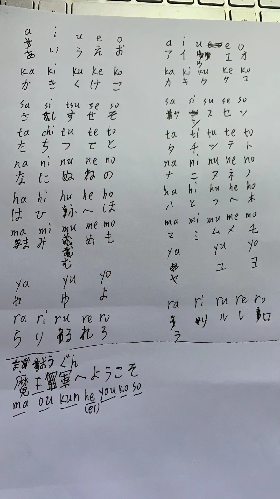

- 英语：
	- 单词：（10）
		- pace SYN step
			- 步伐，
			- pace of life
				- 生活节奏
		- outcome
		- dilemma
		- tolerate
		- deliberately
		- consistent
		- strategy
		- access
		- endeavour
		- ambiguous
	- 对话练习：
		- do you love the pace of country?
		  youToday at 3:08 AM
		  yeah I do! 🙌
		  DanToday at 3:09 AM
		- Do you?
		  DanToday at 3:09 AM
		- yes
		  youToday at 3:09 AM
		  I'm in love haha that's awesome!
		  DanToday at 3:09 AM
		- I will make every deveavour to love you
		  youToday at 3:11 AM
		  You have no idea how much that means to me!
		  DanToday at 3:11 AM
		- I will make every endeavour to love you
		  youToday at 3:12 AM
		  That's all I could ever ask for.
	- 2010年Text3：
		- In their recent work, however, some researchers have ==come up with== the finding that influentials have ==far less== impact on social epidemics than ==is generally supposed==. In fact, **they** don't seem to be required at all.
		- 在他们最近的（研究）工作中，然而，一些研究者提出：有个发现被普遍支持，是有影响力的人们在社会流行的影响远小于被认为的那样。事实上，他们看起来完全不被需要。
		- 参考译文：然而在最近的研究中，一些研究人员发现，有影响力的人士对社会潮流的影响远远不像被通常认为的那么大。事实上，社会潮流看起来似乎根本不需要这些有影响力的人士。
		- The researchers' argument stems from a simple observation about social influence:With the exception of a few celebrities like Oprah Winfrey——whose outsize presence is primarily a funtion of media, not interpersonal, influence——even the most members of a population simply don't interact with that many others.
- 教育综合333： 中教史——[[孔丘的教育思想]]
- 计算机：
	- C语言入门书：[C_PrimerPlus_6](file:///E:/logseq/logseq/pdf/C_PrimerPlus_6.pdf)
	- C语言标准库： [C标准库](https://www.runoob.com/cprogramming/c-standard-library.html)
- 政治：
- 日语：
	- 