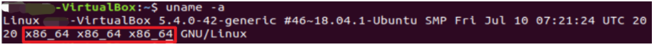

title:: Ubuntu安装Node.js

- Ubunt 安装Node.js
  打开终端
- 第一步：查看自己应该安装什么版本的Node
- ```
  uname -a
  ```
- 
-
- 第二步：根据需求官网下载匹配自己系统的文件：
- 英文网址：https://nodejs.org/en/download/
- 中文网址：http://nodejs.cn/download/
- 注意：可以先在自己的电脑上下载好，然后通过Xftp移动至虚拟机上，目录自行指定。
- 第三步：解压上传的压缩包
- tar -xvf  node-v14.18.0-linux-x64.tar.xz  
  1
- ② mv  node-v14.18.0-linux-x64  nodejs 
  1
- ③确认一下nodejs下bin目录是否有node 和npm文件，如果有执行下一步，如果没有重新下载执行上边步骤；
  1
- 第四步：建立软连接，变为全局
- ①sudo ln -s /app/software/nodejs/bin/npm /usr/local/bin/ 
  1
  ②ln -s /app/software/nodejs/bin/node /usr/local/bin/
  1
- 第五步：检查一下
- node -v
  1
- 第六步：报错后执行
- sudo apt install nodejs
  1
- 第七步：检查确认
- node -v
  1
- ————————————————
  版权声明：本文为CSDN博主「贴瓷砖的小钟」的原创文章，遵循CC 4.0 BY-SA版权协议，转载请附上原文出处链接及本声明。
  原文链接：https://blog.csdn.net/zwslovexyj/article/details/120650976