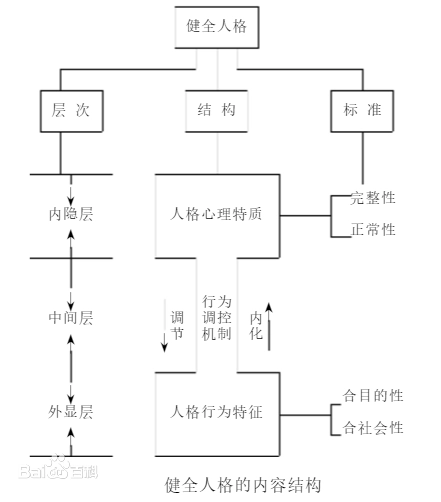

- 健全人格的标准编辑 播报
  1.爱心
  一个人只有拥有爱心，他的存在才能对他人和社会具有价值，所以无论在东方还是在西方的道德体系中都将爱心作为道德的最高准则，它是道德思想的出发点，也是道德思想的最终归宿。人们的爱心大小是有差异的，根据爱心的大小可以划分出许多不同的层次。爱心的最低层次是只爱自己，爱心很小的人甚至对自己的子女和配偶也缺乏真爱，他们抚养子女的目的只是为了“养儿防老”，出于纯功利性的动机，如果不能达到此目的，他们可以毫不顾惜地将子女抛弃，甚至虐杀。第二层次的爱是对子女和配偶的爱，因为这种爱包涵着一些本能的生物学因素，因而这种爱的层次并不很高。第三层次的爱是对父母和兄弟姊妹的爱，许多人能够无条件地全心爱自己的子女，却不能以同样的爱心对待父母，所以爱父母和兄弟姊妹的层次要比爱子女和配偶的层次更高。第四层次的爱是对朋友和同事等与自己相识并有较深交往的人的爱，这类人重友情，对朋友真心实意，他们对朋友的关怀和帮助完全出于情感的需要，没有其他功利性目的，付出时并不期望得到什么回报。第五层次的爱是对素不相识的人的爱，这种爱有时可以超越国家和民族的界限，成为对整个人类乃至众生的爱。拥有这种爱的人表现出强烈的同情心和对生命价值的关怀。现实社会中处于第二、第三层次的人较多，达到第四层次的人也有一些，而能达到最高层次则不容易。
  2.忍耐
  忍耐实际上是一个人的意志力，也就是在实现目标过程中克服困难的能力。有时也表现在对时机的耐心等待或延迟满足上。这方面素质较好的人面对困难不会轻易放弃自己的目标，因而事业上拥有更多的成功机会。对这方面国外的一些专家曾经做过跟踪观察，结果发现在儿童时期表现出较强忍耐力的人，成年后生活及事业上的成功程度明显高于忍耐力较差的人，可见应充分注意对儿童的忍耐力的培养。
  3.宽容
  宽容是指一个人的胸怀宽广，对自己不喜欢的事或不同的意见能够给予适度的包容，对冒犯过自己的人能够原谅。宽容必然会使一个人拥有更多的合作者和支持者，有助于事业的成功，也有助于保持自己内心的平静。
  4.乐观
  乐观是健全人格的一个不可缺少的方面，它能使人更加从容地面对困难和挫折。乐观可以使人发挥更大的主动性和创造性，是事业成功的前提之一。
  5.平和
  指一个人具有较强的调节和控制自己情绪的能力，在遇到不顺心的事时不轻易发怒。具有这种素质的人必然会有良好的人际关系，更善于与他人合作，所以事业上成功的机会更多，家庭生活也更为美满。
  6.节制
  节制是对自身需求的约束能力。每个人都有各种各样的欲望，但对其满足应适可而止，否则无止境地追求很可能导致不利的后果。节制也会使人知足常乐，保持良好的情绪。
  7.谦逊
  谦逊不是表面上和口头上的谦虚，而是发自内心地对自己和他人的客观认识。因为任何成功和失败都受许多因素的制约，既有自身的因素，也有许多个人无法控制的外在因素，所以无论取得多大成功也不应该自高自大，对于不如自己的人也不应轻视。谦逊不仅可以使一个人进步，而且可以减少他人的嫉妒，避免一些不必要的麻烦。
  8.守信
  一个人由于受某些条件的限制可以不答应别人的某些要求，但一旦答应了就应该尽全力做到。只有这样才能得到他人的信任，才能立足于社会。
  9.责任感
  责任感是对自己行为所产生后果的充分考虑，并且勇于承担由此引发的各种后果。责任感可以使一个人具有较强的自我约束力，使自己的行为更符合多数人的利益。
  10.自省
  自我反省在东西方道德思想中都占有非常重要的地位，因为这种素质对人格的发展有很大的作用。人只有通过自省才能发现自身的缺陷，才能够自觉地进行自我调整，从而走向自我完善。
  以上各项标准只是完美人格的理想目标，在现实生活中恐怕没有人能够真正达到完美的境界。但这并不等于说，这样的目标就没有意义，因为我们只有首先知道和承认这一目标，才能不断地努力去实现它。另外，以上标准在实践中还要掌握适度。强调爱心和宽容不等于善恶不分和放弃是非原则，强调节制和乐观不等于满足现状，不思进取。 [2] 
  健全人格结构编辑 播报
  健全人格是一个结构性概念。把人格看成是一个相对稳定而又不断变化的结构，是认知人格理论的共识。一般认为，人格是由一组特质组成，特质是构成人格的基本单位。特质决定着个体的具体行为。人格特质在时间上具有稳定性，在空间上具有普遍性；各种人格特质是每个人都有的，不过在表现上因人而异，造成人与人之间的差异。健全人格就是要根据不同的任务要求和不同的人的实际，力争通过努力，让个体在人格特质的表现上有所变化。没有表现出来的要激发和挖掘；表现程度低下的要有所上升和加强；表现极端的要给以疏导和调节以免造成人格障碍。我们认为，作为一个结构性概念，健全人格的结构应当是一个多层次、多水平、多侧面、富有内在逻辑关系的、完整的心理成分构成物。从最一般的意义上说，认知、情感、意志三种心理成分是人格的最基本的构件。它们的和谐发展在人格的健全上意义重大。方俊明教授就把知、情、意三方面达到高层次的发展水平且协调配合得很好的均衡高型的心理结构看作是健全的人格结构。从人格所涉及的心理内容上来分析，大体上应当包含一个人的世界观、人生观、行为的动力与调控系统以及外在的典型的稳定的行为特征。它们也组成了由高到低的逻辑层次结构。世界观、人生观是最高层次的，它制约着一个人的自我意识和行为的动力与调控系统如需要、动机等，人的自我意识和动机情绪系统是居中的调节系统。而中层的人格特质又制约着外在的人格行为特征（如热情大方、谨慎、怀疑、独立等）。 [1] 
  健全人格的心理结构从形式上可以认为是知、情、意三者均衡协调活动的结果。这种心理结构可以减少内心的冲突，高效率地发挥调节与控制个体与内外环境保持动态平衡的心理机能。从内容上看，健全人格则大体包括内隐的人格心理特质和外显的人格行为特征两个方面三个层次。人格心理特质主要包括对社会、集体、他人和自己的态度，以及情感、意志和理智等方面的典型特征。人格行为特征则主要体现于个体的社会适应性行为中。从内隐的层次来分析，健全人格涉及人格心理特质的完整性以及人格心理特征发展的正常性；从外显的层次来看，健全人格反应的是一个人在社会实践活动中表现出来的惯常的行为方式（对自己、对他人、对社会、对环境等）的合目的性和合社会性。而在内隐和外显层次的中间，则存在由自我意识和动机情绪系统组成的行为调控机制，它成为联系两者的桥梁和纽带。这样，我们就将健全人格的心理结构看成工字型结构，如图1所示。
- 