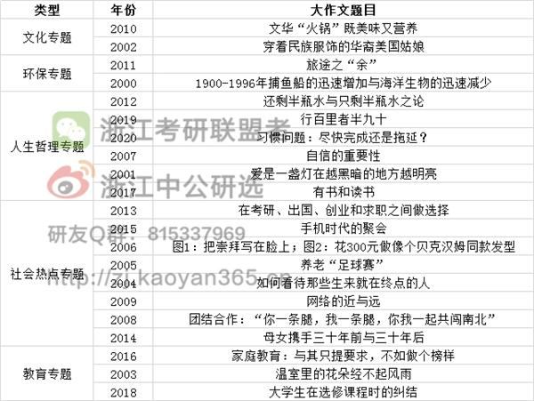

- 01 困难的时候，人人都应该献爱心
- 02 中国与世界的文化交流
- 03 温室里的花经不起风雨
- 04 终点又是新的起点
- 05 辞职信
  年轻人应该赡养父母
- 06 申请信
  偶像崇拜
- 07 建议信
  自信是成功的关键
- 08 道歉信
  合作的重要性
- 09 建议信
  网络的“远”和“近”
- 10  招募启事
  文化“火锅”，既美味又营养
- 11 推荐信
  旅程之“余”
- 12 欢迎辞+建议信
  积极心态看人生
- 13 邀请信
  大学毕业生的多样人生选择
- 14 建议信
  相携
- 15 推荐信
  手机时代的聚会
- 16 通知
  身教胜于言传
- 
- 2019年 介绍类回复信
   途中。
- 2020年 习惯。
- 2021年 做自己。
- 2022 校园讲座
-