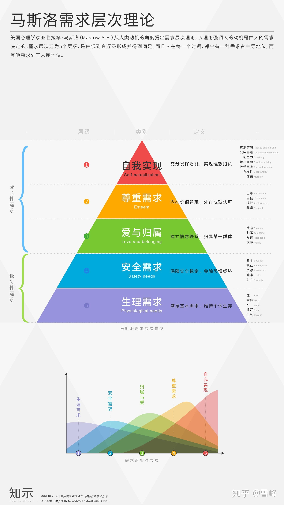

- 
- 美国心理学家亚伯拉罕·马斯洛（Maslow.A.H.）从人类动机的角度提出需求层次理论，该理论强调人的动机是由人的需求决定的。而且人在每一个时期，都会有一种需求占主导地位，而其他需求处于从属地位。
  
  人的需求分成生理需求、安全需求、归属与爱、尊重需求和自我实现五个层次。需求是由低到高逐级形成并得到满足的。
  
  在马斯洛看来，一个饥肠辘辘的人，人生的目标就是找到食物果腹；一个缺乏安全感的人，他对生命的追求是安全；归属与爱和尊重需求也一样，得不到满足就会有缺失；“自我实现”是“少有人走的路”，只有那些低级需求真正满足的人才容易走上自我实现之路。
## **01 需求的层次**

**1、生理需求 Physiological needs**

指人类维持自身生存的最基本要求，包括饥、渴、衣、住、性、健康方面的需求。生理需要是推动人行动的最强大的动力。

未满足生理需求的特征：什么都不想，只想让自己活下去，思考能力、道德观明显变得脆弱。例如：当一个人极需食物时，会不择手段地抢夺食物。

**2、安全需求 Safety needs**

指人对安全、秩序、稳定及免除恐惧、威胁与痛苦的需求。

为满足安全需求的特征：感受到身边事物的威胁，觉得这世界是不公平或是危险的。认为一切事物都是危险的、而变的紧张焦虑、彷徨不安、认为一切事物都是“恶”的。

**3、归属与爱 Belonging and Love**

指人要求与他人建立情感联系，以及隶属于某一群体并在群体中享有地位的需要。

这一层次的需要包括两个方面。一是友爱的需要，即人人都需要伙伴之间、同事之间的关系融洽或保持友谊和忠诚；人人都希望得到爱情，希望爱别人，也渴望接受别人的爱。

二是归属的需要，即人都有一种归属于一个群体的感情，希望成为群体中的一员，并相互关心和照顾。这种需求属于较高层次的需求。

缺乏归属与爱需求的特征：因为没有感受到身边人的关怀，而认为自己没有价值活在这世界上。例如：一个没有受到父母关怀的青少年，认为自己在家庭中没有价值，所以在学校交朋友，无视道德观和理性地积极地寻找朋友或是同类。譬如说：青少年为了让自己融入社交圈中，帮别人做牛做马，甚至吸烟，恶作剧等。

**4、尊重需求 Esteem**

属于较高层次的需求，如：成就、名声、地位和晋升机会等。尊重需求既包括对成就或自我价值的个人感觉，也包括他人对自己的认可与尊重。

无法满足尊重需求的特征：变的很爱面子，或是用积极行动获得他人认同，也很容易被虚荣所吸引。例如：利用暴力来证明自己的强悍、努力读书让自己成为医生、律师来证明自己在这社会的存在和价值、富豪为了自己名利而赚钱，或是捐款等。　　

**5、自我实现 Self-actualization**

是最高层次的需求，指人希望最大限度地发挥自身潜能，不断完善自己，完成与自己的能力相称的一切事情，实现自己理想的需要。

马斯洛提出，为满足自我实现需要所采取的途径是因人而异的。自我实现的需要是在努力实现自己的潜力，使自己越来越成为自己所期望的人物。

缺乏自我实现需求的特征：觉得自己的生活被空虚感、无意义感推动着，要去做证明自己身为一个“人”应该在这世上做的事。
## **02 需求层次之间的关系**

在马斯洛看来，需求的产生由低级向高级的发展是波浪式地推进的，在低一级需求没有完全满足时，高一级需求就产生了，而当低一级需求的高峰过去了但没有完全消失时，高一级需求就逐步增强，直到占绝对优势。

低层次的需求基本得到满足以后，它的激励作用就会降低，其优势地位将不再保持下去，高层次的需求会取代它成为推动行为的主要原因。有的需求一经满足，便不能成为激发人们行为的起因，于是被其他需求取而代之。
## **03 追求更高层次的目标**

一个人可以有自我实现的愿望，但要达到自我实现的境界，成为一个自我实现的人，却不是每个人都能办到的，这种人也只是少数而已。

人的最高需要即自我实现就是以最有效和最完整的方式表现他自己的潜力，唯此才能使人得到高峰体验。

马斯洛需求层次理论对我们来说的最大意义就在于，它告诉了我们，人在满足了基本的需求之后，就要去实现更高的需求和目标。